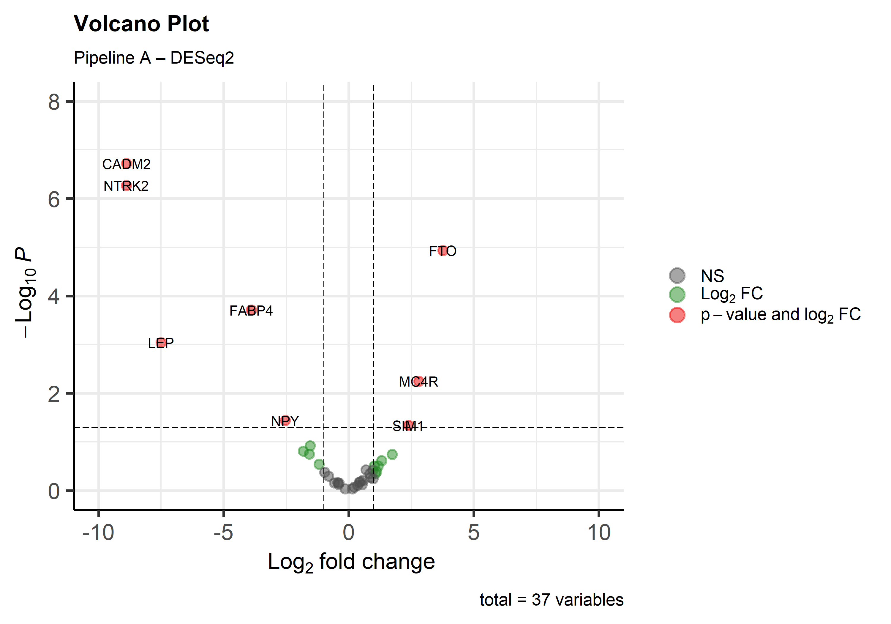
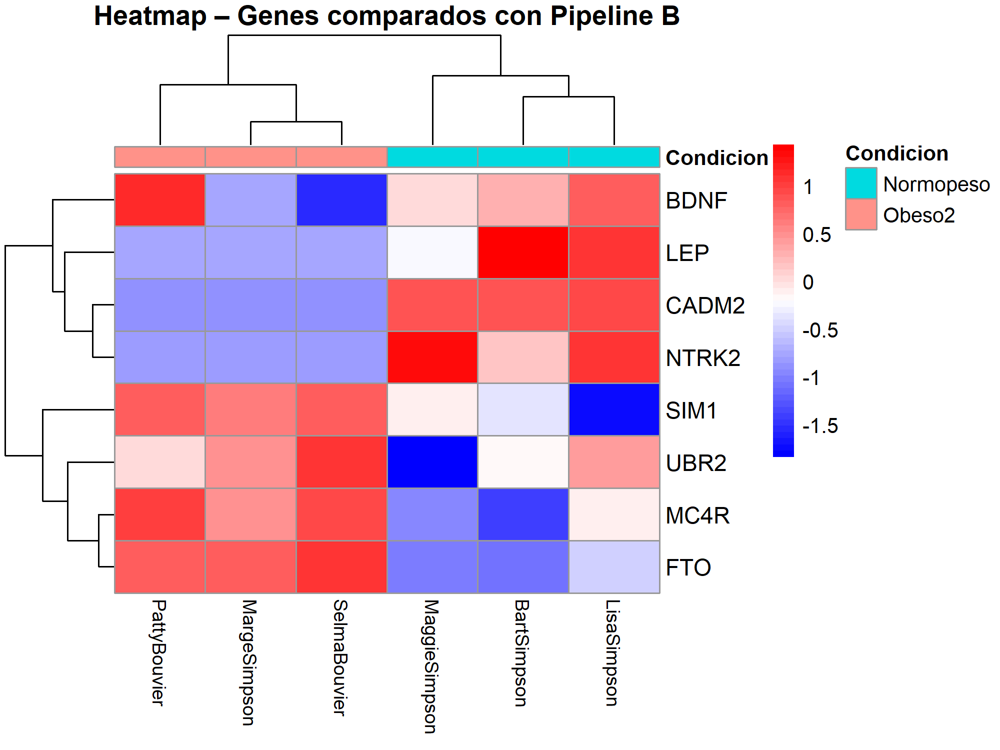

# RNAseq-obesity-simpsons-
RNA-seq pipeline sobre el análisis de expresión diferencial de genes relacionados con la obesidad mediante RNA-seq. Incluye control de calidad, alineación, análisis de DEG, gráficos volcano plots y heatmaps. Máster en Bioinformática. Grupo 4.

# 🧬 RNA-seq Differential Expression Analysis - Obesity
**Master en Bioinformática | Secuenciación y Ómicas de Próxima Generación**

## 👥 Grupo 4
- Caren Moreno
- Analia Patrana  
- Angel Emanuel Guerrero

## 📋 Descripción
Análisis de expresión diferencial de genes relacionados con la obesidad
utilizando datos simulados de RNA-seq basados en personajes de Los Simpson.
Se comparan perfiles metabólicos: Obeso1, Obeso2 y Normopeso.

## 🔧 Pipeline
FastQC → STAR/HISAT2 → featureCounts/Salmon → DESeq2/edgeR → Visualización

## 📊 Resultados principales

## 🗂️ Estructura del repositorio
[Agregar Describición detalladamente en una tabla o lista de carpetas]

## ▶️ Cómo reproducir el análisis
[Agregar descripción de pasos ordenados]

## 🔗 Poster
[Agregar imagen del poster]
